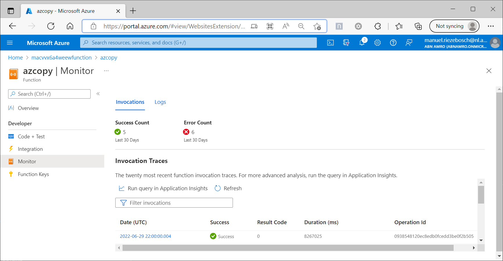
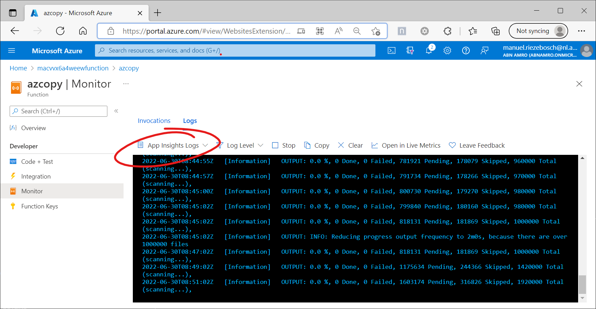
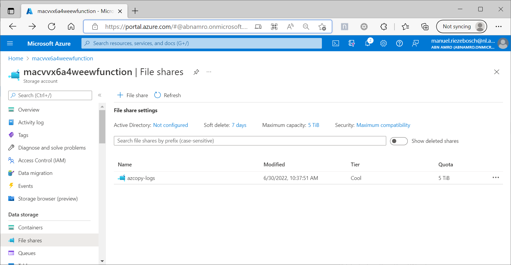

# azcopy & azure function

In order to sync two _storage containers_, this _Azure Function_ wraps _azcopy_ into a _PowerShell_ function.

## Azure Function

Since it's the easiest to invoke an external program, the function is written in `PowerShell`. For a quick startup, the executable(s) are packed into the deployment.

See [adr](adr/azure-function/).

## App Service Plan

### Tier

P3V3: 
* Enough memory, vCPU and disk space
* Dedicated host, guarenteed to run >1h

### Linux

* <s>Disk space issues</s>
* <s>Memory issues</s>
* <s>Extremely slow</s>
* Stable

### Windows

* Quick, on a beefy tier
* Redirect log location and plan directory to temp folder
* Crashes after couple of hours

See [adr](adr/app-service-plan/).

## Deployment

Peek into the [azure-pipelines.yml](./azure-pipelines.yml) to see how the function and the underlying infrastructure is deployed. In short:

* bicep is used to deploy resources in an `FSCP3.0` environment
* `az functionapp` is used to deploy the functionapp from a `config-zip`.

See [adr](adr/deployment/).

## Logging and Monitoring

To examine the results peek into Log Analytics via functionapp -> Functions -> azcopy -> Monitor

For running functions peek into Log Analytics via functionapp -> Functions -> azcopy -> Monitor -> Logs -> App Insights

To view the errors (for failed copies e.g.) download the logs in the storage account fromt the `azcopy-logs` file share:
